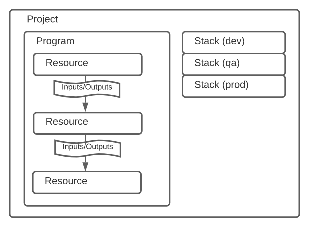

> https://www.pulumi.com/docs/intro/concepts/ (원문)
>
> 번역이 매끄럽지 못한 부분이 있을 수 있습니다.

## support lang

`TypeScript`, `JavaScript`, `Python`, `Go`, and `.NET`

## overview



Pulumi 프로그램은, 일반적으로 동작하는 [프로그래밍 언어](https://www.pulumi.com/docs/intro/languages/)로 작성되었습니다. 이를 통해 당신의 인프라구조 (_aws_, _gcp_ ..)를 어떻게 구성하는지 나타냅니다. 새로운 인프라를 프로그램에 선언하려고 하면, 당신이 원하는 상태의 인프라의 리소스와 일치하는 리소스 객체를 할당하면 됩니다.

이 속성들은 리소스 간의 의존성들을 관리하는데 이용할 수 있습니다. 그리고 필요하다면, 스택 밖으로 export할 수 있습니다.

프로젝트 내의 프로그램은 동작에 대한 소스 코드와 메타데이터를 포함하고 있는 디렉토리입니다. 프로그램을 작성하고 나면, 프로젝트 디렉토리에서 [Pulumi CLI](https://www.pulumi.com/docs/reference/cli/) 를 통해 `pulumi up` 을 실행시키세요.

이 명령은 당신의 프로그램에 독립적이며*isolated* 설정 가능한*configurable* 인스턴스를 생성합니다.

스택은 당신이 테스트하고 어플리케이션 업데이트를 개발하는 다른 배포 환경과 비슷합니다. 예를 들자면, 구분된 `develop`, `staging`, `production` 스택을 가질 수 있는 것이고 계속해서 테스트할 수 있는 것입니다. (against가 아니라 again을 쓰고자 했던 것으로 보인다.)

---

## Example

아래의 프로그램 어떻게 `web-sg` 라고 명명한 AWS EC2 보안 그룹을 하나의 ingress rule로 생성하고, 이 보안 그룹을 이용해 `t2.micro` EC2를 생성하는지 나타냅니다.

보안 그룹을 이용하려면, EC2 리소스에 보안 그룹 ID가 필요합니다.  
Pulumi는 보안그룹 리소스의 속성인 `name` 으로 이를 가능하게 합니다.  
(아래 코드의 `group.name`.)

Pulumi는 리소스 간의 의존성을 이해합니다. 그리고 그 관계들의 유사성을 이용해 스택이 초기화될 때 올바른 명령을 보장합니다.

마침내, 서버 IP 주소와 DNS 이름이 스택 결과물로 출력되고, 이 값들은 CLI 커맨드나 다른 스택을 통해 접근 가능해졌습니다.

#### python code

```python
import pulumi
import pulumi_aws as aws

group = aws.ec2.SecurityGroup('web-sg',
    description='Enable HTTP access',
    ingress=[
        { 'protocol': 'tcp', 'from_port': 80, 'to_port': 80, 'cidr_blocks': ['0.0.0.0/0'] }
    ])

server = aws.ec2.Instance('web-server',
    ami='ami-6869aa05',
    instance_type='t2.micro',
    vpc_security_group_ids=[group.name] # 위의 보안그룹을 참조
)

pulumi.export('public_ip', server.public_ip)
pulumi.export('public_dns', server.public_dns)
```

---

다른 언어의 코드나 더 자세한 사항을 알고 싶다면 [원문](https://www.pulumi.com/docs/intro/concepts/) 아래의 Concept Detail을 참조하세요.
